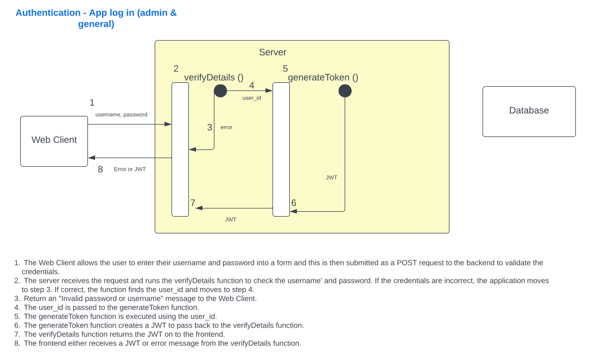
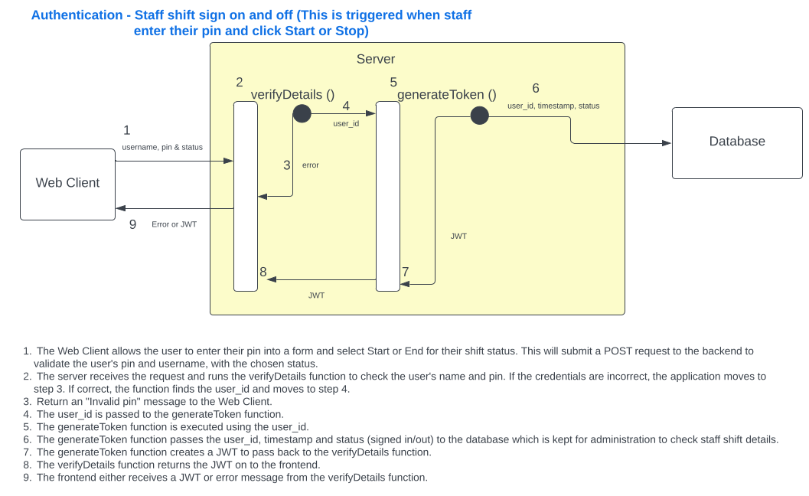
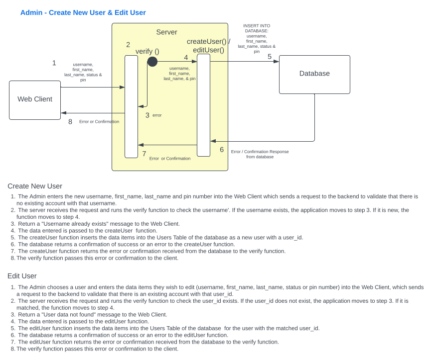
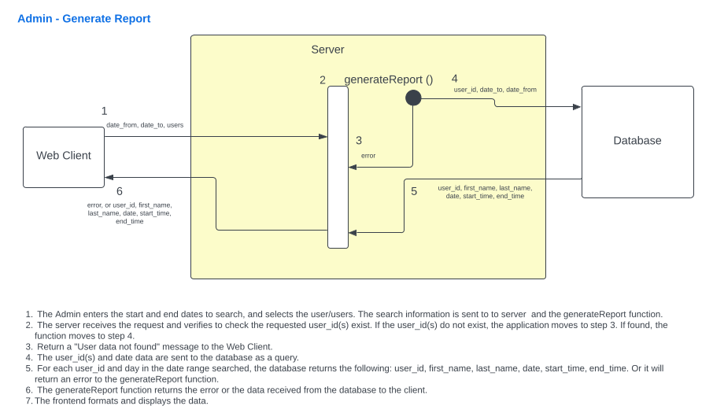
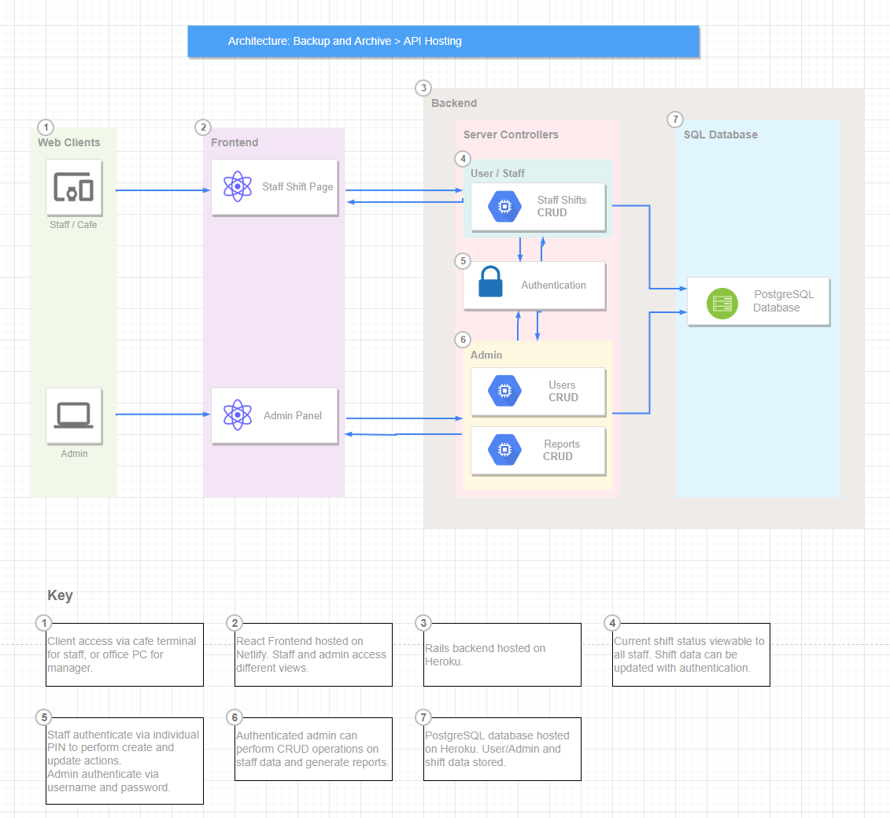

# T3A2A-Final-Coder-Assessment-Part-A

## Team Members
- Andrew Devitt
- Raj Ranj

## GitHub Repository
https://github.com/AnderDevitt/T3A2A-Final-Coder-Assessment-Part-A

## WEBSITE DESCRIPTION
This website is an application designed for a local cafe where the manager wishes to have a system that will track staff sign-in and sign-out times for their shifts and then allow the manager to output reports based on this data. The application will not be connected to any other systems such as employee databases or payroll, and is to be a self-contained app that will run on a tablet in the cafe for staff to use when clocking in and out, and the managers PC for administrator access. 

## PURPOSE
The application has two purposes. Firstly to allow staff to accurately record the start and end times of their shifts. The client brief states that this must be simple for staff to accomplish and as clear as possible. Shift data will be stored in a relational database.

The second purpose is to allow the admin to create adn edit staff data, and most importantly, generate simple reports on the shift start and end times or workers. The reports generated will allow the manager to accurately check staff work times in the cafe and compare with the payroll department. 

## FUNCTIONALITY AND FEATURES
### Site Navigation
The site will have a nav bar at the top of the screen which will allow navigation to all pages for a logged-in Administrator, the staff shifts page for cafe staff, and  log-in/log-off options.    

Pages have links and buttons to perform actions and navigate to new pages and back.

### Main Page for Staff
The cafe will have a general user login to access the main page which staff will interact with on shift. This login will secure the app and allow it to remain open during the cafe operating hours. The client has requested that staff not have to individually take time logging in.

On this page:
- A clock will clearly display the current time for staff to see.
- For each member of staff currently 'active', a form section will be displayed with their name, a field to ewnter their pin number, and buttons to start and end their shift.
- When a pin is entered and the start button is pressed, it will clearly show as pressed and deactivated so staff know they have clocked on.

### Admin Panel
The administrator will see the same basic page generated for the cafe staff, however it will display more options and display all staff members whether their status is 'active' or 'deactive'. This view will provide basic CRUD operations for the Administrator (cafe manager). 

There will be buttons and links to:
- Allow the Admin to generate reports on staff hours
- Allow the Admin to open a form and create new staff.
- Allow the editing of an existing staff member's details.
- Allow staff status to be changed from active (available to work) and deactive (currently unavailable or no longer employed). Due to the nature of the database and purpose for this data, it is undesireable for staff data to be deleted at any time.

### Generate Reports
The client has requested that the app be able to generate reports for all staff currently on the roster (active) and individual staff members over a given date range. The form will request this information from the relational SQL database and return it for display on the manager's screen.

A sprinkle feature that will be included in the application if possible, is that the data can then be exported in a format compatible with Microsoft Excel. 

### Alerts and Notices
The application will display alert and notice massages at the top of the screen to inform the user about successful actions and errors.

## TARGET AUDIENCE
The cafe is a busy environment in the lobby of an office building in the Brisbane CBD. A lot of foot traffic and customers pass through the lobby throughout the day which creates an active work environment. This has been taken into account in the app design by the client and developers.

The application has two target audiences. First and foremost the client (the cafe manager) who will use the application to monitor staff shifts and assist in payroll checking. Most features of the application are for the use of the administrator. The second target group are the cafe employees, who will use it to clock in and out at work. This is the only interaction they need to perform with the app. There are a small number of employees on shift at any time, so they are occasionally very busy.

### The manager needs:
- Accurate times recorded for each employess who works on any day.
- To be able to add and edit staff details.
- Access to the data stored in the database in a clear and readable format.

### The staff need:
- Quick and simple access to the app on shift to minimise time waste.
- To see the current time that will be logged.
- Speedy authentication when they clock in/out.
- Clear indication that they have successfully clocked on/off.

## TECH STACK
The tech stack for this application will be the following.

### Code
#### Frontend:
- HTML
- JavaScript
- React
- Material UI & Styled Components

#### Backend:
- Ruby
- Ruby on Rails

### Database
- PostgreSQL

### Source Control and Project Management
- Git
- Github
- Trello

### Deployment
- Netlify (frontend)
- Heroku (backend and database)

## DATAFLOW DIAGRAM
Dataflow diagrams are separated by function.
### System log in and log out

### Staff Start or End their Shift

### Administrator Creates a New User or Edits a User

### Administrator Generates a Report

### APPLICATION ARCHITECTURE DIAGRAM

## USER STORIES
The user personas are: user, active staff member, admin.

User: In the context of the app, a user is a staff member with a password for the applicaion.
Active Staff Member: Staff members can be deactivated by the manager when they no longer work for the cafe or take an extended break. Active members are visible on the Web Client when staff are logging their shift times.
Admin: This is the manager for the cafe.

### User 
- As a user I can log into the system.
- As a user I can log out of the system.
- As a user I cn view the main page and list of active staff for the current day.

### Active Staff Member
- As an active staff member I can do all the same things as a user.
- As an active staff member I can enter my pin number.
- As an active staff member I can click the start and end buttons to begin or end my shift.

### Admin
- As an admin I can do all the same things as an active staff member.
- As an admin I can see the options to add a staff member, edit staff details, and generate reports.
- As an admin I can add a new staff member.
- As an admin I can edit a staff member's details.
- As an admin I can deactivate staff members who leave and reactivate returning staff.
- As an admin I can edit my own details.
- As an admin I can generate a report on staff work times.

## WIREFRAMES

## PROJECT MANAGEMENT 
Our team has used Trello as a project management tool. 

