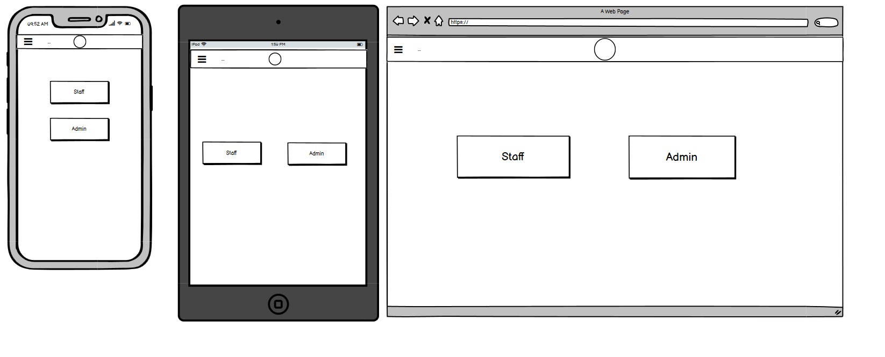
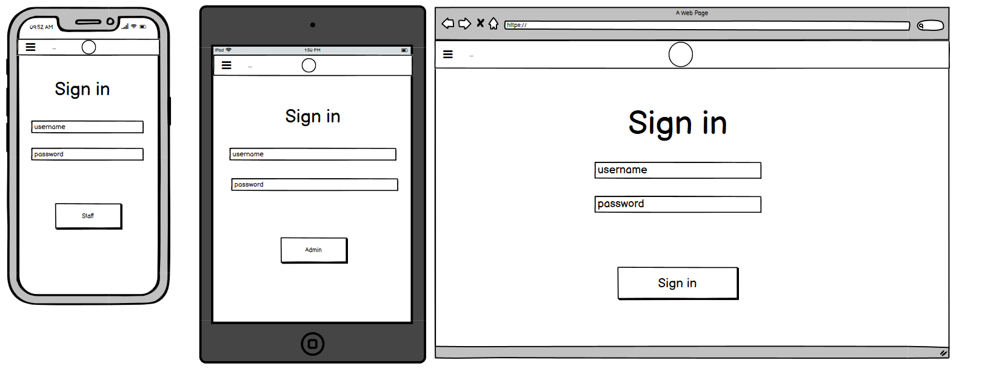
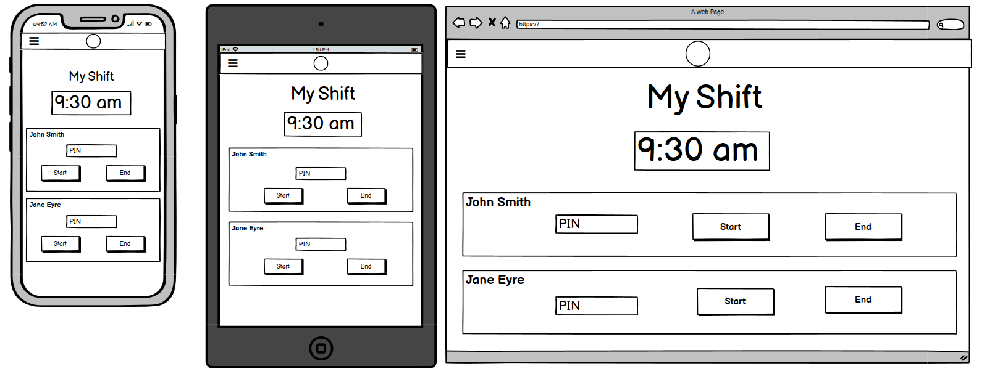
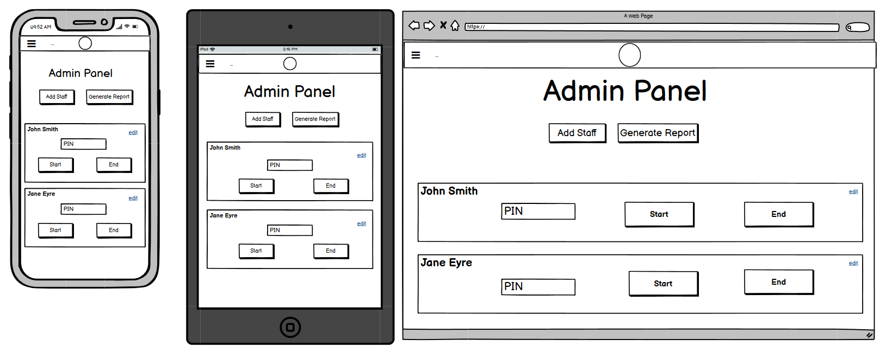
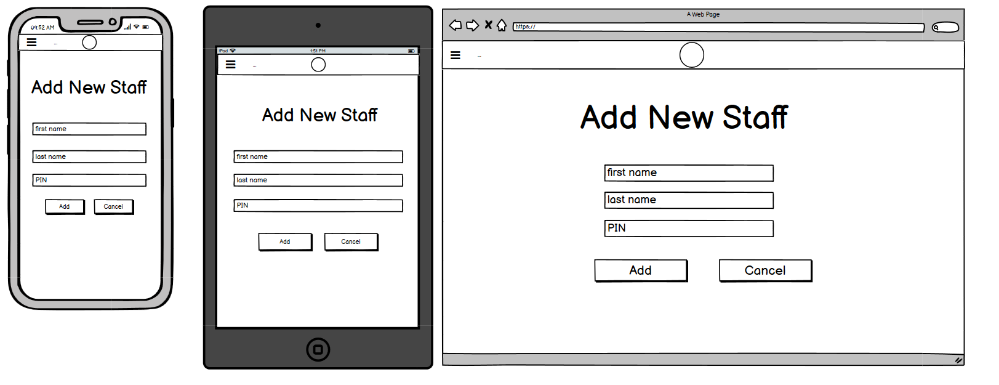
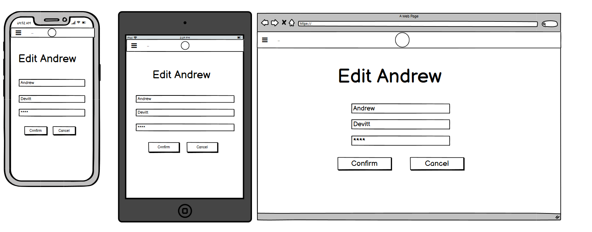
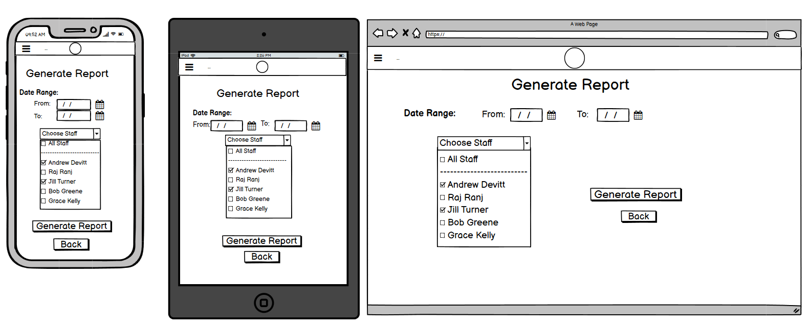
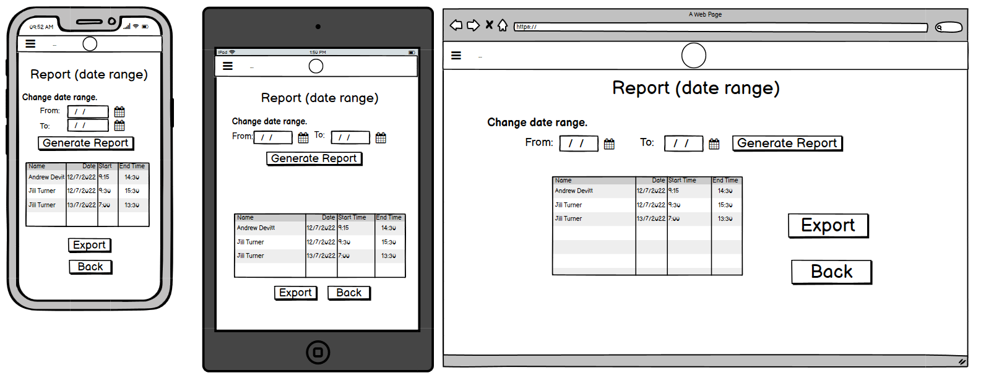

# T3A2A-Final-Coder-Assessment-Part-A

## Team Members

- Andrew Devitt
- Raj Ranj

## GitHub Repository

https://github.com/AnderDevitt/T3A2A-Final-Coder-Assessment-Part-A

## WEBSITE DESCRIPTION

This website is an application designed for a local cafe where the manager wishes to have a system that will track staff sign-in and sign-out times for their shifts and then allow the manager to output reports based on this data. The application will not be connected to any other systems such as employee databases or payroll, and is to be a self-contained app that will run on a tablet in the cafe for staff to use when clocking in and out, and the managers PC for administrator access.

## PURPOSE

The application has two purposes. Firstly to allow staff to accurately record the start and end times of their shifts. The client brief states that this must be simple for staff to accomplish and as clear as possible. Shift data will be stored in a relational database.

The second purpose is to allow the admin to create adn edit staff data, and most importantly, generate simple reports on the shift start and end times or workers. The reports generated will allow the manager to accurately check staff work times in the cafe and compare with the payroll department.

## FUNCTIONALITY AND FEATURES

### Site Navigation

The site will have a nav bar at the top of the screen which will allow navigation to all pages for a logged-in Administrator, the staff shifts page for cafe staff, and log-in/log-off options.

Pages have links and buttons to perform actions and navigate to new pages and back.

### Main Page for Staff

The cafe will have a general user login to access the main page which staff will interact with on shift. This login will secure the app and allow it to remain open during the cafe operating hours. The client has requested that staff not have to individually take time logging in.

On this page:

- A clock will clearly display the current time for staff to see.
- For each member of staff currently 'active', a form section will be displayed with their name, a field to ewnter their pin number, and buttons to start and end their shift.
- When a pin is entered and the start button is pressed, it will clearly show as pressed and deactivated so staff know they have clocked on.

### Admin Panel

The administrator will see the same basic page generated for the cafe staff, however it will display more options and display all staff members whether their status is 'active' or 'deactive'. This view will provide basic CRUD operations for the Administrator (cafe manager).

There will be buttons and links to:

- Allow the Admin to generate reports on staff hours
- Allow the Admin to open a form and create new staff.
- Allow the editing of an existing staff member's details.
- Allow staff status to be changed from active (available to work) and deactive (currently unavailable or no longer employed). Due to the nature of the database and purpose for this data, it is undesireable for staff data to be deleted at any time.

### Generate Reports

The client has requested that the app be able to generate reports for all staff currently on the roster (active) and individual staff members over a given date range. The form will request this information from the relational SQL database and return it for display on the manager's screen.

A sprinkle feature that will be included in the application if possible, is that the data can then be exported in a format compatible with Microsoft Excel.

### Alerts and Notices

The application will display alert and notice massages at the top of the screen to inform the user about successful actions and errors.

## TARGET AUDIENCE

The cafe is a busy environment in the lobby of an office building in the Brisbane CBD. A lot of foot traffic and customers pass through the lobby throughout the day which creates an active work environment. This has been taken into account in the app design by the client and developers.

The application has two target audiences. First and foremost the client (the cafe manager) who will use the application to monitor staff shifts and assist in payroll checking. Most features of the application are for the use of the administrator. The second target group are the cafe employees, who will use it to clock in and out at work. This is the only interaction they need to perform with the app. There are a small number of employees on shift at any time, so they are occasionally very busy.

### The manager needs:

- Accurate times recorded for each employess who works on any day.
- To be able to add and edit staff details.
- Access to the data stored in the database in a clear and readable format.

### The staff need:

- Quick and simple access to the app on shift to minimise time waste.
- To see the current time that will be logged.
- Speedy authentication when they clock in/out.
- Clear indication that they have successfully clocked on/off.

## TECH STACK

The tech stack for this application will be the following.

### Code

#### Frontend:

- HTML
- JavaScript
- React
- Material UI & Styled Components

#### Backend:

- Ruby
- Ruby on Rails

### Database

- PostgreSQL

### Source Control and Project Management

- Git
- Github
- Trello

### Deployment

- Netlify (frontend)
- Heroku (backend and database)

## DATAFLOW DIAGRAM

Dataflow diagrams are separated by function.

### System log in and log out

### Staff Start or End their Shift

### Administrator Creates a New User or Edits a User

### Administrator Generates a Report

### APPLICATION ARCHITECTURE DIAGRAM

## USER STORIES

The user personas are: user, active staff member, admin.

User: In the context of the app, a user is a staff member with a password for the applicaion.
Active Staff Member: Staff members can be deactivated by the manager when they no longer work for the cafe or take an extended break. Active members are visible on the Web Client when staff are logging their shift times.
Admin: This is the manager for the cafe.

### User

- As a user I want to be able to log into the system with a general staff log-in, so that only staff can see the clock-in page and individual staff don't have to sign in to the system.
- As a user I want to log out of the system at the end of the cafe operating hours so that the app is secure.
- As a user I want to always see the shifts page and list of active staff during the cafe hours so that all staff can quickly begin and end their shifts from the one page.

### Active Staff Member

- As an active staff member I want to do all the same things as a user.
- As an active staff member I want to enter my pin number so that I can authenticate my actions on the shifts screen.
- As an active staff member I want to click the start and end buttons so that I can begin or end my shift and record the correct time that I do so.
- As an active staff member I want to be able to see a system clock so that I know the exact time that will be recorded for my shift start and end.

### Admin

- As the admin I want to do all the same things as an active staff member.
- As the admin I want to see admin options added to the shifts screen, so that I can perform additional functions (create user, edit user, generate report).
- As the admin I want to be able to begin and end staff shifts, so that I can do this when staff have forgotten or in an emergency. 
- As the admin I want to add new staff members when people join the team.
- As the admin I want to be able to edit a staff member's details, so that I can update their information, reset forgotten pins, and change active status.
- As the admin I want to deactivate staff members who leave and reactivate returning staff, so that only staff currently working are displayed on the shifts screen.
- As the admin I want to deactivate staff who leave so that they remain in the database and I do not need to delete their data.
- As the admin I want to be able to edit my own details so that I can change my username and password.
- As the admin I want to generate a report on staff work times for a given period so that I can compare times worked with payroll data.

## WIREFRAMES

### Loading Page
This is the first page the application will open to. It is not strictly necessary to the current intended deployment of the application, but is a legacy requirement of the client for the original desired startup of the application. In the original design specification, the frontend would only be run locally in the cafe and on the manager's PC. It was intended that clicking the 'Staff" button would immediately open the Shifts Page without any authentication. Clicking on the 'Admin' button would however require authentication. The client still desires this functionality in the final product, however due to the initial Netlify deployment for this project, he has agreed that staff authentication is currently best practice. 

### Sign In Page
Both staff and admin will be directed to this screen from the loading page. For staff, there will be a general cafe username and password so that the first member to arrive can start up the system and staff will therefore not have to enter individual usernames and passwords. The admin will also enter their username and password. 

Staff will then be directed to the page view titled "My Shift". The admin will be redirected to the 'Admin Panel' which is identical to the My Shift page, but has extra options for the administrator.

### Shifts Page
All staff will interact with this page. Aside from the loading and sign in pages, this is the only view that staff will see. Here an employee can enter their pin number and then click 'start' to clock-in. They will be authenticated and their start time will be sent to the database. At the end of their shift they enter their pin and click 'end' and their finish time is sent. To log out of the system at the end of the shift they will use the log-out option in the navbar menu. 

### Admin Panel
The Admin Panel has the same list of active staff with their start and end buttons as on the My Shift page. This will allow the admin to clock staff on/off if there is an issue on the staff terminal, someone forgets to do so, or should there be an emergency such as sudden illness.

The clock is replaced with buttons to 'Add New Staff' and 'Generate Report', and 'edit' links are added to each staff member's listing.

### Add New Staff Page
The admin will be directed to this page when choosing to add a new staff member. They can include the firstname, lastname, and set a new pin number. Saving an entry will return them to the Admin Panel.

### Edit Staff Page
Identical to the new staff page, this page is reached via the edit links next to staff details. The page will display the staffmember's name in the title. Saving changes will return the admin to the Admin Panel. There will also be a 'back' button added in case changes are not desired. 

### Generate Report Page
This page is accessed via the 'Generate Report' button on the Admin Panel. On this page, the admin can select a start and end date for the report. From a drop-down menu, they can use checkboxes to select all staff, or any staff on the list. Clicking the button to generate the report here will fetch the relevant data from the database and display it on the DisplayReport Page. 

### Display Report Page
This page has a section at the top where the admin can conveniently adjust the date range. Below, a table is generated that will show the staff names, start and end times, of all staff who worked on the days specified in the date range. The 'Export' button is currently a sprinkle feature to export the report to a Excel format file.

## PROJECT MANAGEMENT

Our team has used Trello as a project management tool.
